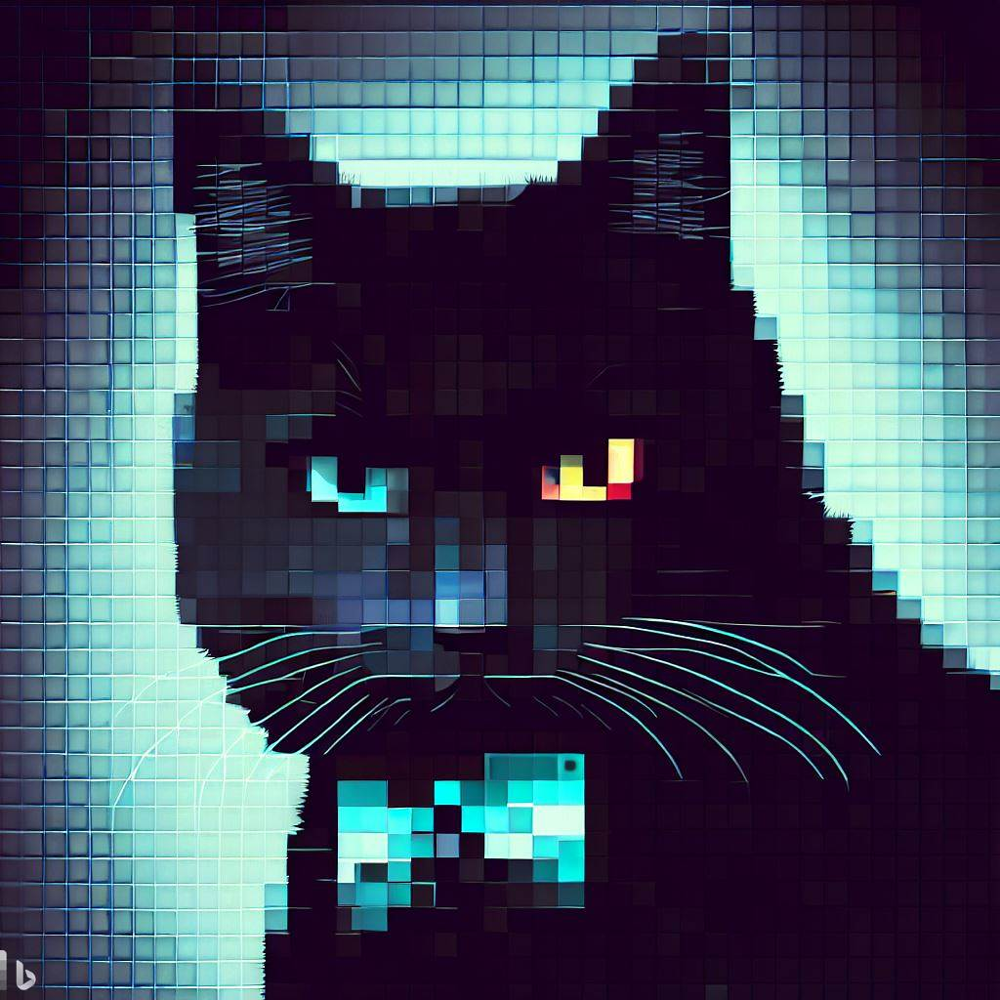

[**中文**](./README.md) | [**English待建**](./README-EN.md)

  

# Yu-turning-llama：建立于中文心理学知识库的llama微调模型

### text project: Tuning LLaMA Model With Chinese psychology knowledge

 

### wait for update
