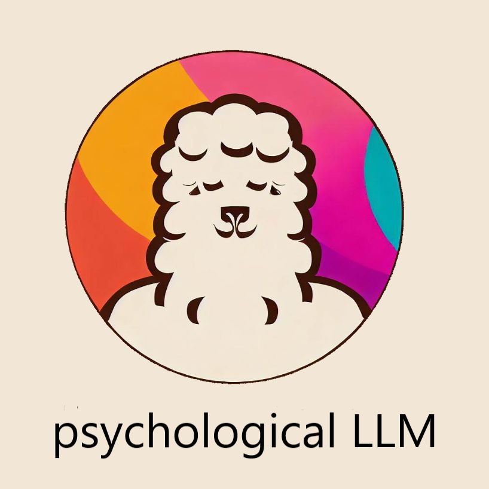

[**中文**](./README.md) | [**English待建**](./README-EN.md)

<p align="center" width="100%">
<a href="https://github.com/hyouo/Yu-turning-llama/" target="_blank"></a>
</p>

  

# Yu-turning-llama：建立于中文心理学知识库的llama微调模型

### text project: Tuning LLaMA Model With Chinese psychology knowledge


[](https://github.com/hyouo/Yu-turning-llama/edit/main/LICENSE) [](https://www.python.org/downloads/release/python-390/)

  
本项目开源了经过中文医学指令精调/指令微调(Instruct-tuning) 的LLaMA-7B模型。我们通过医学知识图谱和GPT3.5 API构建了中文医学指令数据集，并在此基础上对LLaMA进行了指令微调，提高了LLaMA在医疗领域的问答效果。


此外，我们还尝试利用GPT3.5 API将医学文献中的【结论】作为外部信息融入多轮对话中，在此基础上对LLaMA进行了指令微调。目前。我们只针对"心理咨询/主框架"进行模型训练。在未来，我们计划发布融入文献结论的医学对话数据集，并且会针对心理咨询相关的所有内容训练模型。


## 更新日志
**[2023] 待续**

[2023/05/11] 增加了项目思路以及自述

## A Quick Start

首先安装依赖包，python环境建议3.9+

```

pip install -r requirements.txt

```

### 模型下载

LoRA权重可以通过百度网盘或Huggingface下载：

对LLaMA进行指令微调的LoRA权重文件
Link
下载LoRA权重并解压，解压后的格式如下：


```
#1.对LLaMA进行指令微调的LoRA权重文件
#基于医学知识库
lora-llama-psy/
  - adapter_config.json   # LoRA权重配置文件
  - adapter_model.bin   # LoRA权重文件

#基于医学文献
lora-llama-med-literature/
  - adapter_config.json   # LoRA权重配置文件
  - adapter_model.bin   # LoRA权重文件

```


### Infer

我们在`./data/infer.json`中提供了一些测试用例，可以替换成其它的数据集，请注意保持格式一致
  

运行infer脚本


```
#基于医学知识库
bash ./scripts/infer.sh

#基于医学文献
#单轮
bash ./scripts/infer-literature-single.sh

#多轮
bash ./scripts/infer-literature-multi.sh
```

  

也可参考`./scripts/test.sh`

  

### 数据集构建

我们采用了公开和自建的中文医学知识库，主要参考了[cMeKG](https://github.com/king-yyf/CMeKG_tools)。
同时参考了[华驼项目](https://github.com/SCIR-HI/Huatuo-Llama-Med-Chinese)

医学知识库围绕疾病、药物、检查指标等构建，字段包括并发症，高危因素，组织学检查，临床症状，药物治疗，辅助治疗等。知识库示例如下:

  

```

{"class": "精神疾病", "中心词": "抑郁症", "症状": ["持续的沮丧和情绪低落", "兴趣丧失", "睡眠问题", "精力不足", "自我负面评价", "注意力不集中", "自杀念头或行为"], "诊断方法": ["临床面谈", "抑郁症问卷评估"], "治疗方式": ["药物治疗（抗抑郁药）", "心理治疗（认知行为疗法、心理动力疗法等）", "电击疗法"], "发病因素": ["遗传因素", "生活事件", "荷尔蒙变化", "慢性疾病", "药物滥用"], "多发性发病部位": ["大脑神经化学物质不平衡"], "常见并发症": ["焦虑症", "自杀行为", "药物滥用"]}
{"类": "抑郁症治疗药物", "中心词": "抗抑郁药", "性状": ["药物多为口服片剂或胶囊"],  "分类": ["选择性5-羟色胺再摄取抑制剂（SSRIs）", "三环抗抑郁药（TCA）", "单胺氧化酶抑制剂（MAOIs）", "杂环类抗抑郁药（Atypical Antidepressants）"], "规格": ["剂量和剂型因药物种类而异"], "OTC类型": ["处方药，通常不是非处方药（OTC）"], "适应证": ["治疗抑郁症、焦虑症、强迫症、恶心、疼痛等"], "通用名": ["抗抑郁药"]}
{"中心词": "心理治疗", "治疗方法": ["认知行为疗法（CBT）", "精神分析", "心理动力学治疗", "人际治疗（IPT）", "药物治疗和心理治疗的联合使用"], "治疗效果": ["改善情绪、情感和思维模式", "提高自我认知和自我管理技能", "减轻抑郁症症状", "预防抑郁症复发"], "治疗周期": ["取决于患者病情的严重程度和治疗方法，通常为数周到数月不等"]}
}

```

我们利用GPT3.5接口围绕医学知识库构建问答数据，设置了多种Prompt形式来充分利用知识。

  

指令微调的训练集数据示例如下：

  

```

"input": "最近我一直感到持续的悲伤和情绪低落，失去了兴趣，睡眠有问题，缺乏精力，自我评价消极，难以集中注意力，甚至有自杀的念头和行为。",
"output": "你好，根据你的描述，你可能正在经历抑郁症。抑郁症是一种精神疾病，常见的症状包括持续的悲伤情绪，失去兴趣，睡眠问题，精力不足，自我评价负面，注意力不集中，以及自杀念头和行为。抑郁症的诊断通常需要临床面谈和抑郁症问卷评估。治疗抑郁症的方法包括药物治疗（抗抑郁药）、心理治疗（认知行为疗法、心理动力疗法等）以及电击疗法。抑郁症的发病因素包括遗传因素、生活事件、荷尔蒙变化、慢性疾病和药物滥用。常见并发症包括焦虑症、自杀行为和药物滥用。如果你认为自己可能患有抑郁症，请尽早咨询医生以获取专业帮助。"

```

  

我们提供了模型的训练数据集，共计八千余条，需要注意的是，虽然训练集的构建融入了知识，但是仍存在错误和不完善的地方，后续我们会利用更好的策略迭代更新数据集。

指令微调数据集质量仍有限，后续将进行不断迭代，同时医学知识库和数据集构建代码还在整理中，整理完成将会发布。


此外，我们收集了临床的中文交互语料，清洗出了心理学相关的语料数据。在·`./data_literature/`中我们提供了其中的2k条样例。目前，训练样本的质量仍然有限，在后续我们会进一步迭代数据，会以`公开数据集`的形式对外进行发布。


  

### Finetune

如果想用自己的数据集微调LLaMA，请按照`./data/llama_data.json`的格式构建自己的数据集

运行finetune脚本

```

bash ./scripts/finetune.sh

```

  
  
  

## 训练细节

### 计算资源需求

我们在一张A100-SXM-80GB显卡上进行了训练，训练总轮次10轮，耗时约2h17m。batch_size=128的情况下显存占用在40G左右。预计3090/4090显卡(24GB显存)以上显卡可以较好支持，根据显存大小来调整batch_size。

  

### 实验过程

超参设置和实验过程可以参考wandb的链接:

https://wandb.ai/thinksoso/llama_med/runs/a5wgcnzt/overview?workspace=user-thinksoso

  

## 模型效果参考

{"input": "最近我一直感到持续的悲伤和情绪低落，失去了兴趣，睡眠有问题，缺乏精力，自我评价消极，难以集中注意力，甚至有自杀的念头和行为。",
"output": "首先，根据您的描述，您正在经历一系列症状，包括持续的悲伤情绪、兴趣丧失、睡眠问题、缺乏精力、自我评价负面、注意力不集中，甚至有自杀念头和行为。这些症状提示可能存在一种精神健康问题。有几个因素需要考虑。首先，这些症状符合抑郁症的典型特征。抑郁症是一种常见的精神疾病，表现为情绪低落、失去兴趣和其他症状。其次，抑郁症的诊断通常需要进行临床面谈和抑郁症问卷评估，而您的描述与抑郁症的标准诊断方法相符。另外，需要考虑抑郁症的发病因素。您提到了一些潜在的风险因素，如生活事件、荷尔蒙变化、慢性疾病和药物滥用。这些因素在抑郁症的发病中可能起到一定作用。
最重要的是，抑郁症可以导致严重的身体和心理健康问题，包括焦虑症、自杀行为和药物滥用。因此，及早识别和治疗非常重要。综上所述，基于您描述的症状和可能的风险因素，有理由怀疑您可能患有抑郁症。建议您尽早咨询医生以获取专业的评估和治疗，以改善您的精神健康状况"}


  

## 项目参与者

本项目由[洪瑜](https://github.com/hyouo)提供


 
## 致谢

  

本项目参考了以下开源项目，在此对相关项目和研究开发人员表示感谢。

  

- Facebook LLaMA: https://github.com/facebookresearch/llama
- Stanford Alpaca: https://github.com/tatsu-lab/stanford_alpaca
- alpaca-lora by @tloen: https://github.com/tloen/alpaca-lora
- CMeKG https://github.com/king-yyf/CMeKG_tools
- 华驼 https://github.com/SCIR-HI/Huatuo-Llama-Med-Chinese
- Bing https://www.bing.com 本项目的logo与我的头像由Bing自动生成

  

## 免责声明

本项目相关资源仅供学术研究之用，严禁用于商业用途。使用涉及第三方代码的部分时，请严格遵循相应的开源协议。模型生成的内容受模型计算、随机性和量化精度损失等因素影响，本项目无法对其准确性作出保证。本项目数据集绝大部分由模型生成，即使符合某些医学事实，也不能被用作实际医学诊断的依据。对于模型输出的任何内容，本项目不承担任何法律责任，亦不对因使用相关资源和输出结果而可能产生的任何损失承担责任。

  

## Citation

如果你使用了本项目的数据或者代码，请声明引用

  


待续

```
@misc{alpaca,
  author = {Yu Hong},
  title = {Tuning LLaMA Model With Chinese psychology knowledge},
  year = {2023},
  publisher = {GitHub},
  journal = {GitHub repository},
  howpublished = {\url{https://github.com/hyouo/Evaluation-in-psy-LLM}},
}
```
## 愿景

期望能够为所有有需要的人提供心理咨询服务
